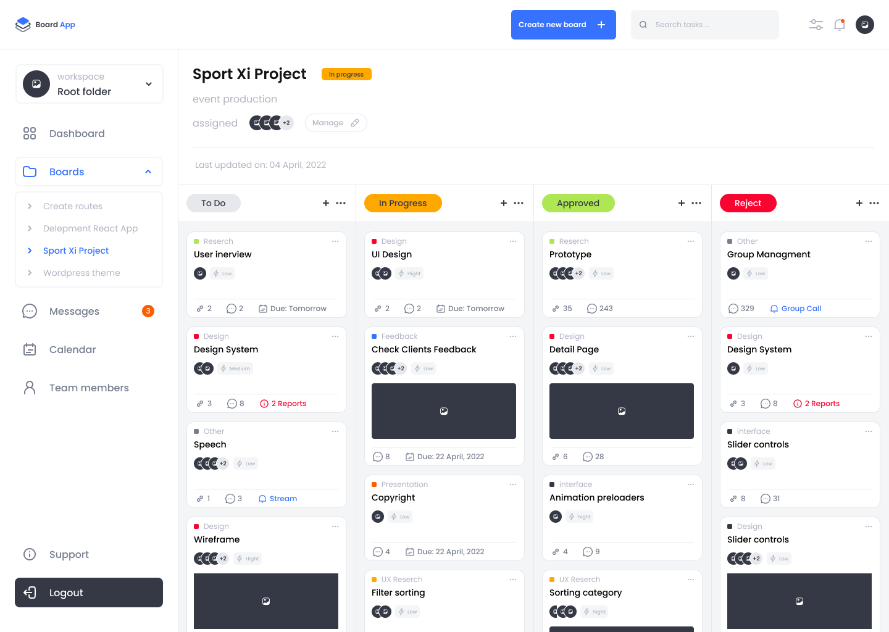

# Swimlane Dashboard

A modern project management dashboard built with [Next.js](https://nextjs.org), featuring swimlane boards, team collaboration, and productivity tools.

## Project Preview



## Live Demo

Experience the Swimlane Dashboard live:

[https://swimlane-dashboard-l81p.vercel.app/boards/sport-xi-project](https://swimlane-dashboard-l81p.vercel.app/boards/sport-xi-project)

> **Try the Sport Xi Project board in action!**

---

## Features

-    Swimlane-style project boards
-    Task management and assignment
-    Team collaboration widgets
-    Calendar integration
-    Responsive UI

## Getting Started

### Prerequisites

-    Node.js (v16 or higher recommended)
-    npm, yarn, pnpm, or bun

### Installation

Clone the repository:

```bash
git clone <repository-url>
cd swimlane-dashboard
```

Install dependencies:

```bash
npm install
# or
yarn install
# or
pnpm install
# or
bun install
```

### Running the Development Server

```bash
npm run dev
# or
yarn dev
# or
pnpm dev
# or
bun dev
```

Open [http://localhost:3000](http://localhost:3000) in your browser to view the app.

## Folder Structure

```
src/
  app/                # Next.js app directory (pages, routes)
  components/         # Reusable UI components
  layouts/            # Layout components
  store/              # State management
  utils/              # Utility functions
public/               # Static assets
```

## Contributing

Contributions are welcome! Please open issues or pull requests for suggestions, bug fixes, or new features.

1. Fork the repository
2. Create your feature branch (`git checkout -b feature/YourFeature`)
3. Commit your changes (`git commit -m 'Add some feature'`)
4. Push to the branch (`git push origin feature/YourFeature`)
5. Open a pull request

## License

This project is licensed under the MIT License.
